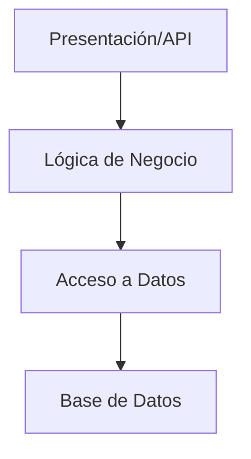
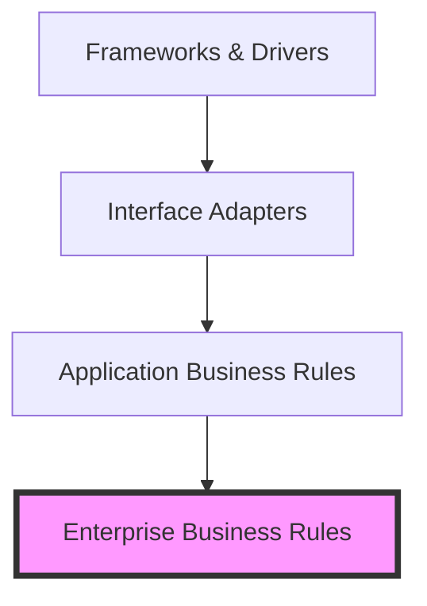
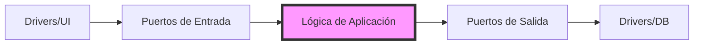
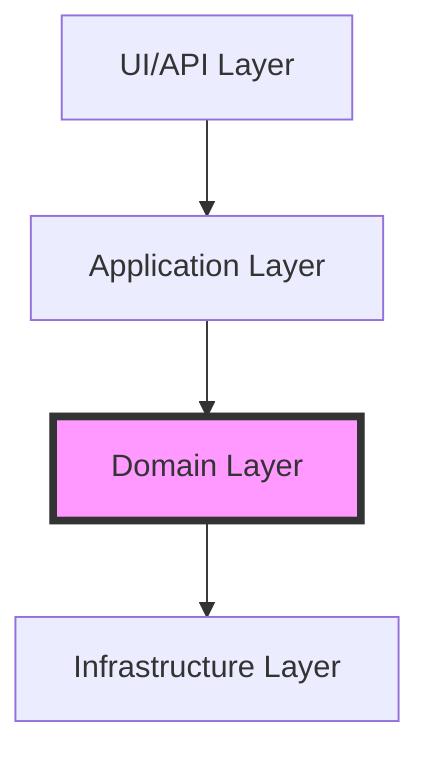
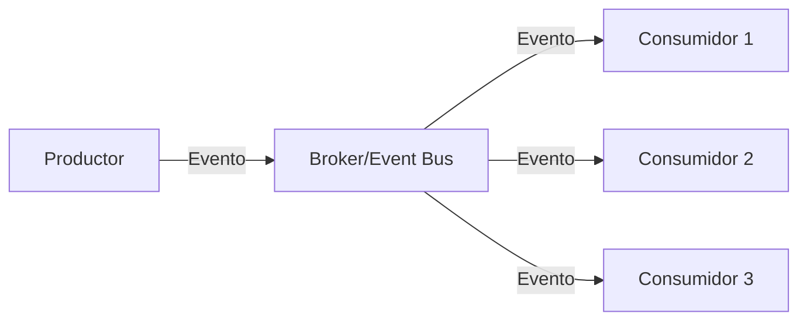

# 🏗️ Arquitectura de Software

La arquitectura de software es el diseño fundamental de un sistema, que define cómo se organizan y relacionan sus componentes. Una buena arquitectura es crucial para construir sistemas mantenibles, escalables y robustos.

## 🎯 ¿Por qué importa separar responsabilidades?

La separación de responsabilidades es fundamental porque:
- **Mantenibilidad**: Facilita la localización y corrección de errores
- **Testabilidad**: Permite probar componentes de forma aislada
- **Escalabilidad**: Facilita la adición de nuevas características
- **Reutilización**: Permite reutilizar componentes en diferentes contextos
- **Colaboración**: Diferentes equipos pueden trabajar en diferentes capas

## 🏛️ Estilos de Arquitectura

### 1. Arquitectura en Capas (Layered Architecture)

La arquitectura más tradicional y común, donde el sistema se divide en capas horizontales:

**Características**:
- Capas bien definidas y jerárquicas
- Cada capa solo depende de la capa inferior
- Fácil de entender e implementar
- Ideal para aplicaciones CRUD simples

### 2. Clean Architecture (Robert C. Martin)

Propuesta por Uncle Bob, se centra en la independencia de frameworks y bases de datos:

**Características**:
- Independencia de frameworks
- Testable
- Independencia de UI
- Independencia de base de datos
- Independencia de cualquier agente externo

### 3. Arquitectura Hexagonal (Ports & Adapters)

También conocida como Ports & Adapters, aísla el dominio de la aplicación:

**Características**:
- Aísla el dominio de la aplicación
- Define puertos claros para entrada/salida
- Facilita el cambio de tecnologías
- Ideal para sistemas con múltiples interfaces

### 4. Domain-Driven Design (DDD)

Enfocado en modelar el dominio del negocio:

**Características**:
- Lenguaje ubicuo
- Entidades y Value Objects
- Agregados y Repositorios
- Bounded Contexts
- Eventos de Dominio

### 5. Event-Driven Design (EDD)

Basado en la producción y consumo de eventos:

**Características**:
- Desacoplamiento temporal
- Escalabilidad horizontal
- Resiliencia
- Trazabilidad
- Procesamiento asíncrono

## 🎯 ¿Cuándo usar cada uno?

### Arquitectura en Capas
- Aplicaciones CRUD simples
- Equipos pequeños
- Requisitos estables
- Ejemplo: Panel de administración

### Clean Architecture
- Aplicaciones empresariales complejas
- Necesidad de independencia de frameworks
- Equipos grandes
- Ejemplo: Sistema bancario

### Arquitectura Hexagonal
- Sistemas con múltiples interfaces
- Necesidad de cambiar tecnologías frecuentemente
- Ejemplo: API con múltiples clientes

### DDD
- Dominios de negocio complejos
- Equipos grandes
- Necesidad de alineación con el negocio
- Ejemplo: Sistema de comercio electrónico

### Event-Driven
- Sistemas distribuidos
- Necesidad de escalabilidad
- Procesamiento asíncrono
- Ejemplo: Sistema de notificaciones

## 📁 Ejemplos Prácticos

En la carpeta `examples` encontrarás implementaciones simples de cada estilo de arquitectura:

1. `layered-basic/`: Implementación básica de arquitectura en capas
2. `clean-architecture/`: Ejemplo de Clean Architecture
3. `hexagonal/`: Implementación de Ports & Adapters
4. `ddd-basic/`: Ejemplo de DDD con Value Objects y Aggregates
5. `event-driven/`: Sistema simple basado en eventos

Cada ejemplo incluye:
- README explicativo
- Estructura de carpetas
- Implementación básica
- Caso de uso simple

## 📚 Recursos Adicionales

- [Clean Architecture - Robert C. Martin](https://blog.cleancoder.com/uncle-bob/2012/08/13/the-clean-architecture.html)
- [Domain-Driven Design - Eric Evans](https://domainlanguage.com/ddd/)
- [Patterns of Enterprise Application Architecture - Martin Fowler](https://martinfowler.com/books/eaa.html)
- [Event-Driven Architecture - Martin Fowler](https://martinfowler.com/articles/201701-event-driven.html) 