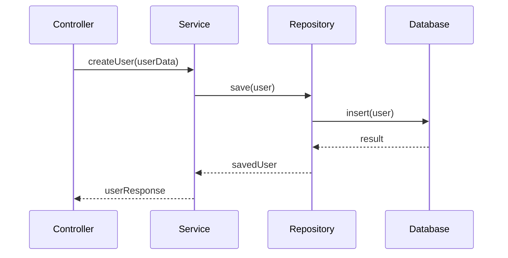

# 🏗️ Arquitectura en Capas Básica

Este ejemplo demuestra una implementación simple de arquitectura en capas usando Node.js. El caso de uso es un sistema básico de gestión de usuarios.

## 📁 Estructura del Proyecto

```
layered-basic/
├── src/
│   ├── controllers/     # Capa de presentación
│   ├── services/        # Capa de lógica de negocio
│   ├── repositories/    # Capa de acceso a datos
│   └── models/          # Modelos de datos
├── tests/              # Pruebas unitarias
└── package.json
```

## 🎯 Capas de la Aplicación

1. **Controllers (Presentación)**
   - Maneja las peticiones HTTP
   - Valida datos de entrada
   - Formatea respuestas
   - No contiene lógica de negocio

2. **Services (Lógica de Negocio)**
   - Implementa la lógica de negocio
   - Coordina operaciones entre repositorios
   - Maneja transacciones
   - No conoce detalles de persistencia

3. **Repositories (Acceso a Datos)**
   - Abstrae el acceso a datos
   - Implementa operaciones CRUD
   - Maneja la persistencia
   - No contiene lógica de negocio

## 💡 Ejemplo de Flujo



## 🚀 Cómo Ejecutar

1. Instalar dependencias:
```bash
npm install
```

2. Ejecutar el servidor:
```bash
npm start
```

3. Probar los endpoints:
```bash
curl -X POST http://localhost:3000/users -H "Content-Type: application/json" -d '{"name":"John Doe","email":"john@example.com"}'
```

## 🧪 Pruebas

```bash
npm test
```

## 📝 Notas de Implementación

- Cada capa tiene una responsabilidad única
- Las dependencias fluyen hacia abajo
- No hay dependencias circulares
- Fácil de testear cada capa de forma aislada
- Fácil de mantener y extender

## 🎯 Caso de Uso: Gestión de Usuarios

Este ejemplo implementa:
- Creación de usuarios
- Búsqueda de usuarios
- Actualización de usuarios
- Eliminación de usuarios

Cada operación demuestra cómo las responsabilidades se separan entre las diferentes capas. 