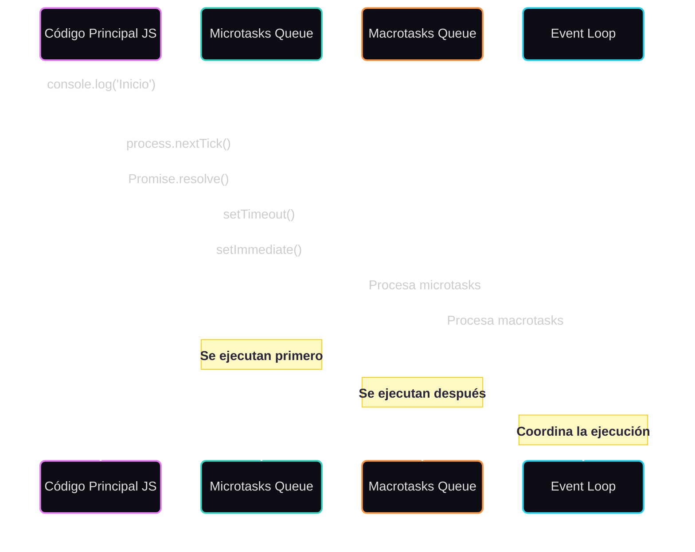

# 🌀 Event Loop en Node.js

El **Event Loop** es el mecanismo que le permite a Node.js manejar múltiples tareas al mismo tiempo, a pesar de que JavaScript corre en un solo hilo (single-threaded). Es como un director de orquesta que decide cuándo se ejecuta cada cosa.

Gracias al Event Loop, Node.js puede realizar operaciones I/O no bloqueantes de manera eficiente.

## 🔁 ¿Cómo funciona?

El Event Loop funciona en ciclos o "vueltas". En cada vuelta, revisa qué tareas hay pendientes (I/O, timers, callbacks, promesas, etc.) y las va ejecutando en un orden específico.

## 🧩 Fases del Event Loop

El Event Loop en Node.js tiene seis fases principales que se ejecutan en orden:

1. **Timers**: Ejecuta callbacks de `setTimeout()` y `setInterval()`.
2. **I/O callbacks**: Procesa operaciones asíncronas completadas.
3. **Idle, prepare**: Fases internas de Node.js.
4. **Poll**: Revisa nuevos eventos I/O o espera.
5. **Check**: Ejecuta callbacks de `setImmediate()`.
6. **Close callbacks**: Maneja eventos de cierre (como `socket.on('close')`).

## 🕓 Orden de ejecución (simplificado)

1. Código síncrono (se ejecuta inmediatamente)
2. `process.nextTick()` (microtask interna de Node.js, tiene prioridad máxima)
3. Promesas (`.then`, `await`) → Microtasks
4. `setTimeout`, `setInterval` → Macrotasks
5. `setImmediate` (después del poll)

> 🎯 Las **microtasks** se ejecutan siempre **antes de pasar a la siguiente fase del loop**.

## 📊 Diagrama visual
>💡 El Event Loop se encarga de vaciar primero la cola de microtasks y luego continúa con las macrotasks, ejecutando una por vez dentro del Call Stack.

## 📁 Ejemplo Práctico

En la carpeta `examples` encontrarás un archivo `event-loop-order.js` que demuestra el orden de ejecución de diferentes tipos de tareas. Este ejemplo te ayudará a entender cómo Node.js prioriza las tareas en el Event Loop.

## 🧠 Conceptos Clave

- **Microtasks**: Tareas de alta prioridad (`Promesas`, `process.nextTick`)
- **Macrotasks**: Tareas de menor prioridad (`setTimeout`, `setInterval`, `setImmediate`, `I/O`)
- **Call Stack**: Pila de ejecución donde se procesan las operaciones síncronas
- **Task Queue**: Cola de tareas asíncronas esperando ser ejecutadas
- **Event Loop**: Orquestador que decide cuándo ejecutar qué tarea

## 🎯 ¿Por qué es importante?
Entender el Event Loop te permite:
- Escribir código no bloqueante
- Evitar cuelgues o callbacks que nunca se ejecutan
- Dominar Promesas, async/await y rendimiento
- Prepararte para entrevistas técnicas ⚔️

## 📚 Recursos útiles
- [Node.js Docs: Event Loop](https://nodejs.org/en/learn/asynchronous-work/event-loop-timers-and-nexttick)
- [Philip Roberts - What the heck is the event loop anyway?](https://www.youtube.com/watch?v=8aGhZQkoFbQ&ab_channel=JSConf)