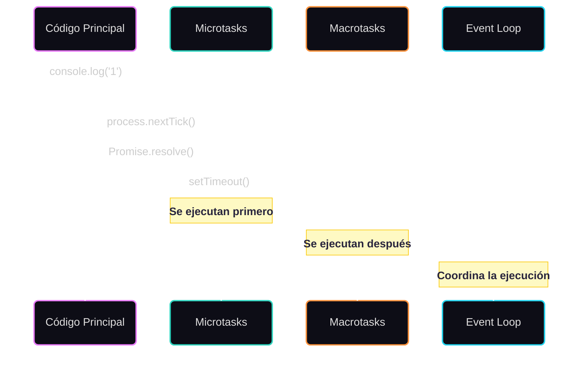

# Event Loop en Node.js

El Event Loop es el mecanismo que permite a Node.js realizar operaciones no bloqueantes I/O, a pesar de que JavaScript es single-threaded. Es como un bucle infinito que espera y ejecuta tareas, permitiendo que Node.js maneje múltiples operaciones de manera eficiente.

## Fases del Event Loop

El Event Loop en Node.js tiene seis fases principales que se ejecutan en orden:

1. **Timers**: Ejecuta callbacks programados por `setTimeout()` y `setInterval()`
2. **I/O callbacks**: Ejecuta callbacks de operaciones I/O completadas
3. **Idle, prepare**: Usado internamente por Node.js
4. **Poll**: Recupera nuevos eventos I/O y ejecuta callbacks relacionados
5. **Check**: Ejecuta callbacks de `setImmediate()`
6. **Close callbacks**: Ejecuta callbacks de cierre (ej: `socket.on('close', ...)`)

## Orden de Ejecución

El orden de ejecución de diferentes tipos de tareas es crucial para entender el Event Loop:

1. Operaciones síncronas (se ejecutan inmediatamente)
2. `process.nextTick()` (microtask)
3. Promesas (microtask)
4. `setTimeout`/`setInterval` (macrotask)
5. `setImmediate` (macrotask)

## Ejemplo Visual

## Ejemplo Práctico

En la carpeta `examples` encontrarás un archivo `event-loop-order.js` que demuestra el orden de ejecución de diferentes tipos de tareas. Este ejemplo te ayudará a entender cómo Node.js prioriza las tareas en el Event Loop.

## Conceptos Clave

- **Microtasks**: Tareas de alta prioridad (Promesas, process.nextTick)
- **Macrotasks**: Tareas de menor prioridad (setTimeout, setInterval, setImmediate)
- **Call Stack**: Pila de ejecución donde se procesan las operaciones síncronas
- **Task Queue**: Cola de tareas asíncronas esperando ser ejecutadas

## ¿Por qué es importante?

Entender el Event Loop es crucial para:
- Escribir código asíncrono eficiente
- Evitar bloqueos en la aplicación
- Optimizar el rendimiento
- Prepararse para entrevistas técnicas 